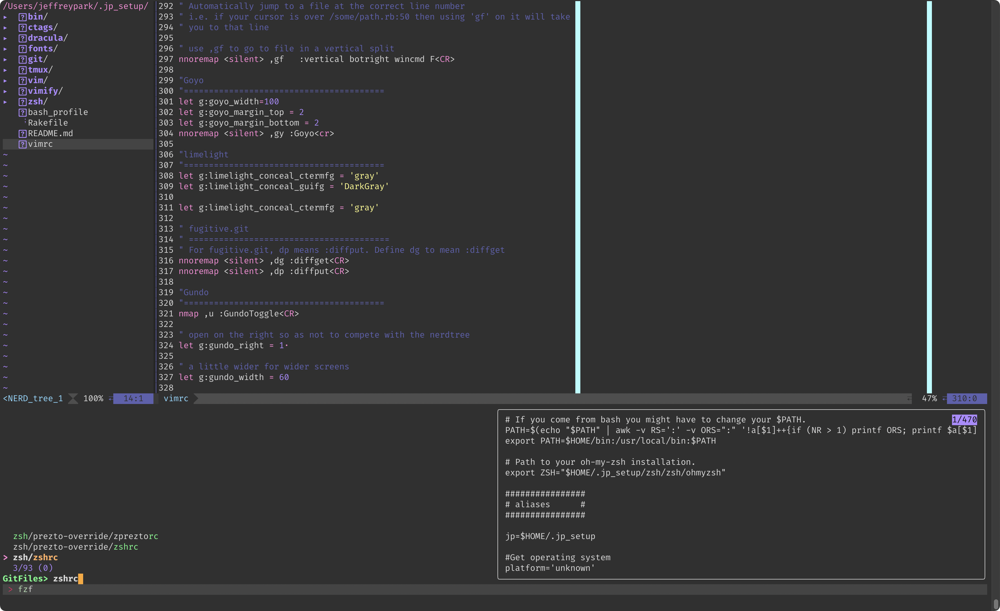
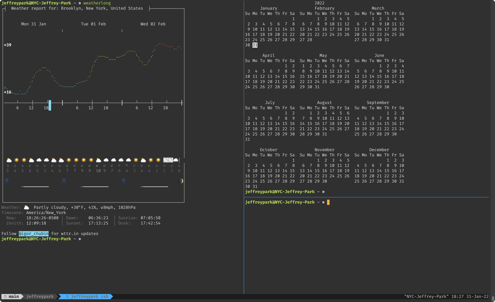

Heavily stolen and modified from [yadr](https://github.com/skwp/dotfiles)

## Installation

`git clone https://github.com/jfypk/jp_setup.git ~/.jp_setup`

Then run:

`cd ~/.jp_setup && rake install`

## Customizations
- use the `ve` alias to see the vimrc and its aliases & shortcuts
- use the `ze` alias to see the zshrc and its aliases & shortcuts
- use `zr` to source zshrc
- use `^r` to reverse search previous commands in zsh

## Images

### Vim

### tmux

#TODO
- add cask/barrel
- add htop
- remove tags and replace with CoC
- add octo

